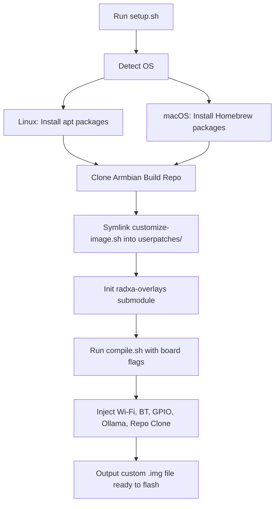

# 🛠️ Custom Armbian Image for d00t and Open Duck Mini V2

This repo builds a fully preconfigured Armbian image for the Radxa Zero 3W (or 3E) with all the robotics-friendly features enabled out-of-the-box.

## ✅ Features
- Wi-Fi & Bluetooth (AIC8800)
- USB OTG in HOST mode
- I²C and GPIO enabled
- Ollama LLM server auto-installed
- GitHub repo cloned to home directory

## 📦 Repo Layout
```bash
repo/
├── setup.sh                  # Run this on your dev machine to build the image
├── customize-image.sh        # Injected into the image to configure Wi-Fi, BT, GPIO, etc.
├── radxa-overlays/           # Radxa-provided device tree overlays (submodule)
└── .gitmodules               # Git submodule config for radxa-overlays
```

## 🚀 Build & Flash

### Prerequisites

#### Linux
- Git, curl, wget
- Build essentials (gcc, make, etc.)
- Python3
- QEMU
- Device Tree Compiler (dtc)
- Cross-compilation tools

#### macOS
- Homebrew package manager
- Git, curl, wget (via Homebrew)
- GCC, make (via Homebrew)
- Python3 (via Homebrew)
- QEMU (via Homebrew)
- Device Tree Compiler (via Homebrew)
- Cross-compilation tools (via Homebrew tap: messense/macos-cross-toolchains)

### 1. Clone This Repo & Init
```bash
git clone --recurse-submodules https://github.com/Aronnaxx/d00t-armbian-radxa-zero3W.git 
cd d00t-armbian-radxa-zero3W
```

### 2. Build the Image
```bash
chmod +x setup.sh
./setup.sh
```
The image will be built under `build/output/images/`. Flash it with `dd`, Etcher, or Raspberry Pi Imager.

### 3. Flash to SD or eMMC

#### Linux
```bash
xz -d Armbian_*_Radxa-zero3*.img.xz
sudo dd if=Armbian_*.img of=/dev/sdX bs=1M status=progress && sync
```

#### macOS
```bash
xz -d Armbian_*_Radxa-zero3*.img.xz
# Replace /dev/rdiskN with your SD card device (use diskutil list to find it)
sudo dd if=Armbian_*.img of=/dev/rdiskN bs=1m && sync
```

### 4. First Boot
- Login: `robot` / `robot`
- Ollama is running as a systemd service
- Wi-Fi available, run `nmtui`
- `/home/robot/Open_Duck_Mini_Runtime` already cloned

## 🧠 Ollama Quickstart
```bash
ollama list             # should show no models
ollama pull gemma:2b    # pull a model
ollama run gemma:2b     # test it
```

## 🧮 GPIO & I²C
```bash
gpiodetect              # list GPIO chips
gpioinfo gpiochip0      # list lines

# I2C
ls /dev/i2c*
i2cdetect -y 0          # scan bus 0
```

## 🧭 Build Process Diagram


---

🧪 Built with ♥ for robotics, AI, and the Duck droid army.
